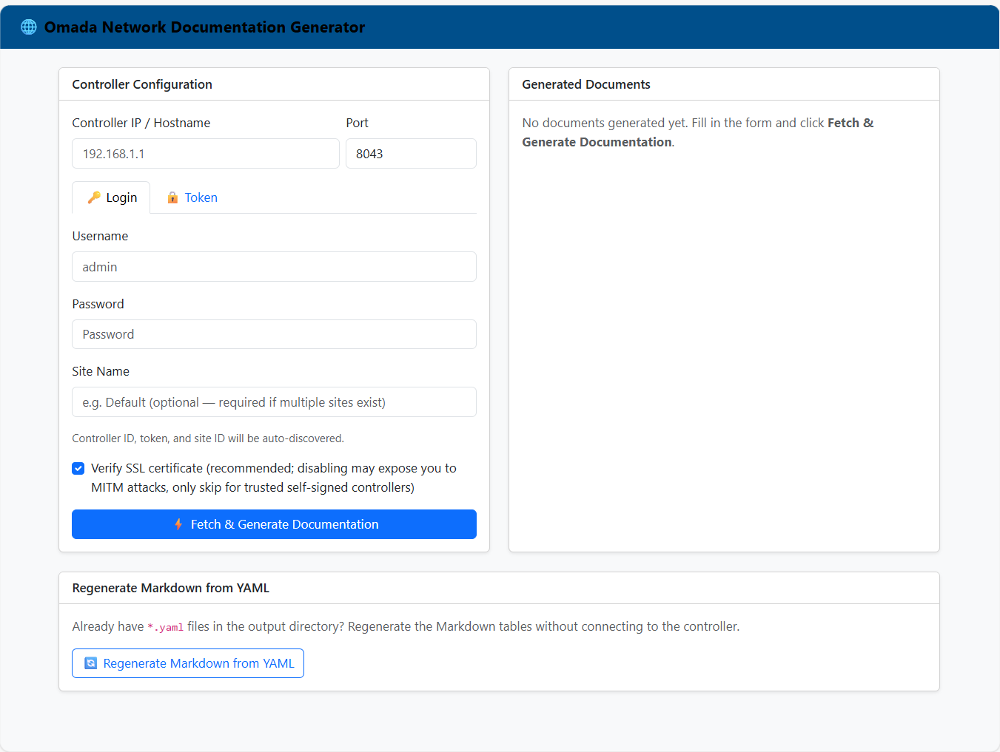

# omada_network

A Python application that uses the **Unofficial Omada SDN API** to extract
network configuration data into YAML files (source of truth) and generate
Markdown documentation tables.

## Features

| Resource | YAML | Markdown |
| --- | --- | --- |
| ACL Rules | ✓ | ✓ |
| IP Groups | ✓ | ✓ |
| Port Groups | ✓ | ✓ |
| Networks | ✓ | ✓ |
| VLANs | ✓ | ✓ |
| Switch Port Profiles | ✓ | ✓ |
| Gateway Settings | ✓ | ✓ |
| SSIDs | ✓ | ✓ |
| DHCP Reservations | ✓ | ✓ |

---

## Web Front End



---

## Project Structure

```text
omada_network/
├── omada/
│   ├── api/
│   │   └── client.py              # Omada SDN HTTP client
│   ├── exporters/
│   │   ├── yaml_exporter.py       # Writes resources to YAML files
│   │   └── markdown_generator.py  # Generates Markdown documentation
│   ├── web/
│   │   ├── app.py                 # Flask application factory
│   │   └── templates/
│   │       ├── index.html         # Main configuration form
│   │       └── doc_view.html      # Document viewer
│   ├── registry.py                # Resource registry (single place to add a resource)
│   └── service.py                 # Orchestration service layer
├── cli.py                         # Click CLI entry-point
├── tests/                         # pytest test suite
├── requirements.txt
├── requirements-dev.txt
└── pyproject.toml
```

---

## Requirements

- Python 3.10+
- An Omada SDN Controller (v5.x / v6.x) with a valid API token or login credentials

---

## Installation

```bash
# Clone the repository
git clone https://github.com/t3knoid/omada_network.git
cd omada_network

# Install dependencies
pip install -r requirements.txt

# For development (includes test dependencies)
pip install -r requirements-dev.txt
```

---

## Configuration

The application supports two authentication modes:

### Option A — Username / Password (recommended)

Provide the **controller address**, **username**, and **password**. The
application will automatically discover the controller ID, obtain a token,
and select the site:

| Parameter | CLI Option | Environment Variable | Default |
| --- | --- | --- | --- |
| Controller IP / hostname | `--controller` | `OMADA_CONTROLLER` | |
| Management port | `--port` | `OMADA_PORT` | `8043` |
| Username | `--username` | `OMADA_USERNAME` | |
| Password | `--password` | `OMADA_PASSWORD` | |
| Site name | `--site-name` | `OMADA_SITE_NAME` | |
| Output directory | `--output-dir` | `OMADA_OUTPUT_DIR` | `docs` |
| Verify SSL cert | `--verify-ssl` | `OMADA_VERIFY_SSL` | off |

```bash
python cli.py fetch \
  --controller 192.168.1.1 \
  --username admin \
  --password secret \
  --output-dir docs

# Multi-site controller — select a site by name
python cli.py fetch \
  --controller 192.168.1.1 \
  --username admin \
  --password secret \
  --site-name "My Office"
```

Auto-discovery steps:

1. **Controller ID** — `GET /api/info` → `result.omadacId`
2. **Token** — `POST /<omadacId>/api/v2/login` with credentials → `result.token`
   (on v6.x controllers the login automatically falls back to port 443 if the
   management port returns an error)
3. **Site ID** — `GET /<omadacId>/api/v2/sites` → uses the sole site
   automatically. For controllers with multiple sites, pass `--site-name`
   to select a site by its display name (case-insensitive), or the tool
   prints available sites and exits.

You can override any auto-discovered value by passing it explicitly (e.g.
`--site-id SITE_ID` or `--site-name "My Office"`).

> **Security note:** `OMADA_PASSWORD` set as an environment variable is
> visible to other processes on the same host. The token obtained via login
> is used only for the duration of the session and is never cached to disk.

### Option B — Token (manual)

Supply all four parameters directly:

| Parameter | CLI Option | Environment Variable | Default |
| --- | --- | --- | --- |
| Controller IP / hostname | `--controller` | `OMADA_CONTROLLER` | |
| Management port | `--port` | `OMADA_PORT` | `8043` |
| Controller ID | `--controller-id` | `OMADA_CONTROLLER_ID` | |
| API Token | `--token` | `OMADA_TOKEN` | |
| Site ID | `--site-id` | `OMADA_SITE_ID` | |
| Site name | `--site-name` | `OMADA_SITE_NAME` | |
| Output directory | `--output-dir` | `OMADA_OUTPUT_DIR` | `docs` |
| Verify SSL cert | `--verify-ssl` | `OMADA_VERIFY_SSL` | off |

### Getting your Controller ID (omadacId)

The `omadacId` can be found by navigating to
`https://<controller-ip>:<port>/api/info` in your browser.

### Getting your Site ID

The Site ID can be found by logging into your Omada controller's web interface
and navigating to a site. The Site ID appears in the URL as the path segment
after `/site/`, for example:

```text
https://<controller-ip>:<port>/<omadacId>/site/<siteId>/dashboard
```

Alternatively, query the controller's API directly:

```text
https://<controller-ip>:<port>/<omadacId>/api/v2/sites?currentPage=1&currentPageSize=100
```

Each site object in the response contains an `"id"` field — that is your Site ID.

### Getting a Token

A valid API token is required to authenticate with the Omada controller. You
can obtain one by calling the controller's login endpoint:

```text
POST https://<controller-ip>:<port>/<omadacId>/api/v2/login
Content-Type: application/json

{
  "username": "admin",
  "password": "your-password"
}
```

A successful response contains a `token` field inside the `result` object:

```json
{
  "errorCode": 0,
  "result": {
    "token": "your-access-token",
    ...
  }
}
```

Use that `token` value with `--token` or the `OMADA_TOKEN` environment
variable.

**Programmatic retrieval (bash):**

```bash
TOKEN=$(curl -sk -X POST \
  "https://<controller-ip>:<port>/<omadacId>/api/v2/login" \
  -H "Content-Type: application/json" \
  -d '{"username":"admin","password":"your-password"}' \
  | python -c "import sys,json; print(json.load(sys.stdin)['result']['token'])")

python cli.py fetch --token "$TOKEN" ...
```

**Programmatic retrieval (PowerShell):**

```powershell
$body = @{ username = "admin"; password = "your-password" } | ConvertTo-Json
$resp = Invoke-RestMethod -Uri "https://<controller-ip>:<port>/<omadacId>/api/v2/login" `
    -Method Post -Body $body -ContentType "application/json" -SkipCertificateCheck
$token = $resp.result.token

python cli.py fetch --token $token ...
```

> **Note:** Tokens expire after a period of inactivity. For automated
> workflows (e.g. GitHub Actions), retrieve a fresh token at the start of
> each run rather than storing a long-lived token in secrets.

---

## CLI Usage

### `fetch` — pull from the controller and generate docs

```bash
# Username/password mode (auto-discovers controller-id, token, site-id)
python cli.py fetch \
  --controller 192.168.1.1 \
  --username admin \
  --password secret

# Custom management port
python cli.py fetch \
  --controller 192.168.1.1 \
  --port 443 \
  --username admin \
  --password secret

# Multi-site controller — select by name
python cli.py fetch \
  --controller 192.168.1.1 \
  --username admin \
  --password secret \
  --site-name "My Office"

# Same using environment variables (ideal for CI/CD)
export OMADA_CONTROLLER=192.168.1.1
export OMADA_USERNAME=admin
export OMADA_PASSWORD=secret
python cli.py fetch

# Token mode with explicit options
python cli.py fetch \
  --controller  192.168.1.1 \
  --controller-id abc123def456 \
  --token       YOUR_TOKEN \
  --site-id     SITE_ID \
  --output-dir  docs

# Enable SSL verification (off by default)
python cli.py fetch --verify-ssl ...
```

### `generate` — regenerate Markdown from existing YAML (no API credentials)

```bash
# Regenerate all Markdown files from the YAML source-of-truth in docs/
python cli.py generate --input-dir docs

# Write Markdown to a different directory
python cli.py generate --input-dir docs --output-dir site/docs

# Via environment variable
OMADA_OUTPUT_DIR=docs python cli.py generate
```

### `serve` — start the web server

```bash
python cli.py serve --host 0.0.0.0 --port 5000
# Open http://127.0.0.1:5000 in your browser
```

---

## Web UI

```bash
python cli.py serve
# Open http://127.0.0.1:5000 in your browser
```

The configuration form offers two authentication tabs:

- **🔑 Login** — enter your username and password; the controller ID, token,
  and site ID are auto-discovered.
- **🔒 Token** — supply the controller ID, token, and site ID manually
  (existing workflow).

> **Note on SSL verification defaults:** The web UI defaults to SSL
> verification **enabled** (checkbox checked) to encourage secure connections
> in the browser-based workflow. The CLI defaults to SSL verification **off**
> (`--verify-ssl` must be passed explicitly) because most self-signed
> controller setups are managed from the command line. This difference is
> intentional — set `OMADA_VERIFY_SSL=true` or pass `--verify-ssl` in the CLI
> if your controller has a valid (non-self-signed) certificate.

Fill in the configuration form and click **⚡ Fetch & Generate Documentation** to
pull data from the controller and create YAML + Markdown files.

To regenerate the Markdown tables from existing YAML files without connecting
to the controller, click **🔄 Regenerate Markdown from YAML**.

Generated Markdown files appear in the **Generated Documents** panel and can
be viewed directly in the browser.

### Persistent sessions (`FLASK_SECRET_KEY`)

By default the web server generates a random secret key on startup.  This
means browser sessions — and the CSRF tokens embedded in every form — are
invalidated every time the server restarts.  For deployments that need
persistent sessions, set the `FLASK_SECRET_KEY` environment variable to a
stable, secret value:

```bash
export FLASK_SECRET_KEY="$(python -c 'import secrets; print(secrets.token_hex(32))')"
python cli.py serve
```

### Air-gapped networks

The web UI loads **Bootstrap 5** and **GitHub Markdown CSS** from public CDNs
(`cdn.jsdelivr.net` and `cdnjs.cloudflare.com`).  On networks without
internet access the UI will still function but will render without styling.

If you need fully offline operation, download the three assets listed below
and place them in a local directory (e.g. `omada/web/static/`):

| Asset | CDN URL |
|---|---|
| Bootstrap 5.3.3 CSS | `https://cdn.jsdelivr.net/npm/bootstrap@5.3.3/dist/css/bootstrap.min.css` |
| Bootstrap 5.3.3 JS | `https://cdn.jsdelivr.net/npm/bootstrap@5.3.3/dist/js/bootstrap.bundle.min.js` |
| GitHub Markdown CSS 5.5.1 | `https://cdnjs.cloudflare.com/ajax/libs/github-markdown-css/5.5.1/github-markdown-light.min.css` |

Then update the `<link>` and `<script>` tags in both
`omada/web/templates/index.html` and `omada/web/templates/doc_view.html` to
point to the local files instead of the CDN URLs. For example, replace:

```html
<link rel="stylesheet"
      href="https://cdn.jsdelivr.net/npm/bootstrap@5.3.3/dist/css/bootstrap.min.css">
```

with:

```html
<link rel="stylesheet"
      href="{{ url_for('static', filename='bootstrap.min.css') }}">
```

Repeat for the Bootstrap JS bundle and the GitHub Markdown CSS file.

---

## GitHub Actions Integration

Store your controller credentials as **repository secrets** and use them in a
workflow.

### Adding Repository Secrets

The GitHub Actions workflow requires the following secrets to be configured in
your repository:

| Secret Name | Description |
| --- | --- |
| `OMADA_CONTROLLER` | IP address or hostname of your Omada controller (e.g. `192.168.1.1`) |
| `OMADA_PORT` | *(Optional)* Management port if not the default `8043` |
| `OMADA_CONTROLLER_ID` | The `omadacId` value (see [Getting your Controller ID](#getting-your-controller-id-omadacid)) |
| `OMADA_TOKEN` | A valid API access token |
| `OMADA_SITE_ID` | The site ID to query |
| `OMADA_SITE_NAME` | *(Optional)* Human-readable site name (alternative to `OMADA_SITE_ID` for multi-site controllers) |
| `OMADA_VERIFY_SSL` | *(Optional)* Set to `true` if your controller has a valid (non-self-signed) certificate |

To add these secrets:

1. Navigate to your repository on GitHub.
2. Click **Settings** → **Secrets and variables** → **Actions**.
3. Click **New repository secret**.
4. Enter the **Name** (e.g. `OMADA_CONTROLLER`) and **Secret** value.
5. Click **Add secret**.
6. Repeat for each secret listed above.

**Tip:** You can also add secrets via the GitHub CLI:

```bash
gh secret set OMADA_CONTROLLER --body "192.168.1.1"
gh secret set OMADA_CONTROLLER_ID --body "your-controller-id"
gh secret set OMADA_TOKEN --body "your-api-token"
gh secret set OMADA_SITE_ID --body "your-site-id"
# Or use site name instead of site ID:
# gh secret set OMADA_SITE_NAME --body "My Office"
```

### Workflow Configuration

```yaml
# .github/workflows/generate-docs.yml
name: Generate Omada Network Documentation

on:
  schedule:
    - cron: "0 2 * * *"   # Run nightly at 02:00 UTC
  workflow_dispatch:        # Allow manual trigger

jobs:
  generate:
    runs-on: ubuntu-latest
    permissions:
      contents: write
    steps:
      - uses: actions/checkout@v4

      - uses: actions/setup-python@v5
        with:
          python-version: "3.12"

      - name: Install dependencies
        run: pip install -r requirements.txt

      - name: Generate documentation
        env:
          OMADA_CONTROLLER:     ${{ secrets.OMADA_CONTROLLER }}
          OMADA_CONTROLLER_ID:  ${{ secrets.OMADA_CONTROLLER_ID }}
          OMADA_TOKEN:          ${{ secrets.OMADA_TOKEN }}
          OMADA_SITE_ID:        ${{ secrets.OMADA_SITE_ID }}
          OMADA_SITE_NAME:      ${{ secrets.OMADA_SITE_NAME }}
        run: python cli.py fetch --output-dir docs

      - name: Commit generated docs
        run: |
          git config user.name  "github-actions[bot]"
          git config user.email "github-actions[bot]@users.noreply.github.com"
          git add docs/
          git diff --cached --quiet || git commit -m "docs: update network documentation [skip ci]"
          git push
```

---

## Output

After a successful run the `docs/` directory contains:

```text
docs/
├── acl_rules.yaml          ← Source of truth (YAML)
├── acl_rules.md            ← Markdown documentation table
├── ip_groups.yaml
├── ip_groups.md
├── port_groups.yaml
├── port_groups.md
├── networks.yaml
├── networks.md
├── vlans.yaml
├── vlans.md
├── switch_port_profiles.yaml
├── switch_port_profiles.md
├── gateway_settings.yaml
├── gateway_settings.md
├── ssids.yaml
├── ssids.md
├── dhcp_reservations.yaml
└── dhcp_reservations.md
```

### Example – DHCP Reservations Markdown

```markdown
# DHCP Reservations

| Network | IP Address | MAC Address | Hostname | Description |
| --- | --- | --- | --- | --- |
| LAN | 192.168.1.50 | aa:bb:cc:dd:ee:ff | printer | Office printer |
```

---

## Development

```bash
# Run tests
python -m pytest tests/ -v

# Run a specific test module
python -m pytest tests/test_client.py -v
```

### Architecture

```text
CLI / Web UI
     │
     ▼
OmadaService              ← orchestrates everything
     │
     ├─► OmadaClient      ← HTTP calls to the controller API
     ├─► YamlExporter     ← writes *.yaml source-of-truth files
     └─► MarkdownGenerator ← renders *.md documentation tables
              │
              └─► Registry (registry.py)
                       └─ ResourceDefinition per resource type
                          (title, fetch_method, row_formatter, sort_key)
```

Adding a new resource type only requires:

1. A new `get_*` method on `OmadaClient`
2. A new `ResourceDefinition` entry in `omada/registry.py`

No other files need to be modified.

---

## License

MIT
